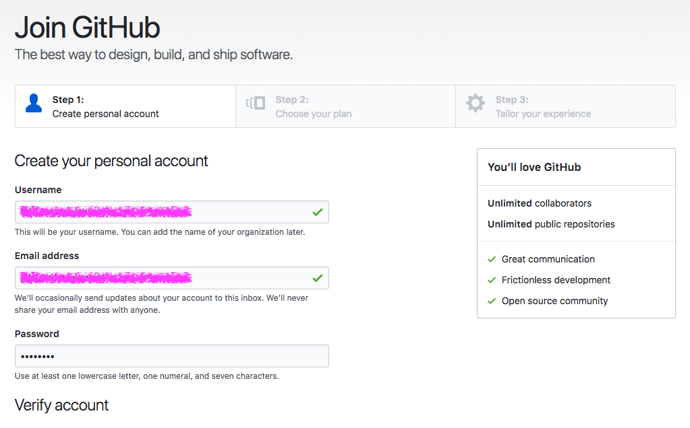
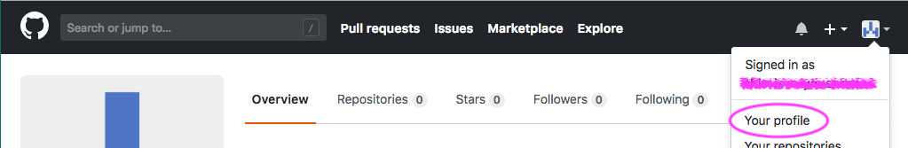
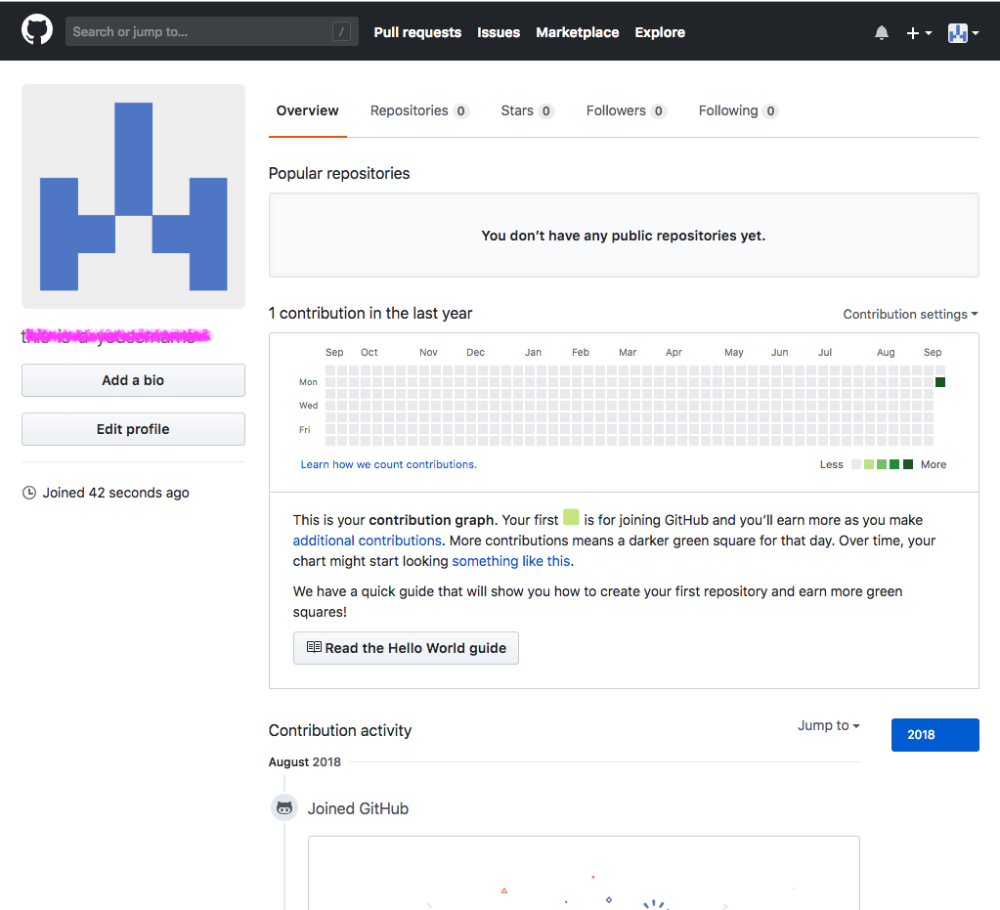

# ReDI School – HTML & CSS Intro

✅
 
Follow this document from top to bottom.  
It's like a checklist to help you setting everything you need for the class.
  
💁‍
 
Try to do it on your own – it will help you getting more familiar with the tools we will use.
  
🙋‍
 Raise your hand if you encounter any obstacle – your teachers are here to assist you at any time!

## Github Account

All of the work we make will be available at any time, everywhere.  
**GitHub** is a website from which you can share your code and collaborate with others.

Click <a href="https://github.com/join" target="_blank">here</a> to start creating yout account.
   

1. Click on **Sign up**   

   

2. Fill in your details. You can use you real name-surname and the mail given to _ReDI School_.   

   

3. Click **Submit**
   

4. Click on **Continue**   

   

5. Click on **Skip**   

   

6. Now you can click on *Your profile*   

   

8. Congrats 🎉  You're now a proud GitHub User and gonna make great things!   

   

## Code Editor

You can write `HTML` & `CSS` even in Word but a Code Editor gives you some help doing this.
  **Visual Studio Code** is a great one.
 Plus, it's free ⭐️

Let's download it <a href="https://code.visualstudio.com/download" target="_blank">here</a>.
